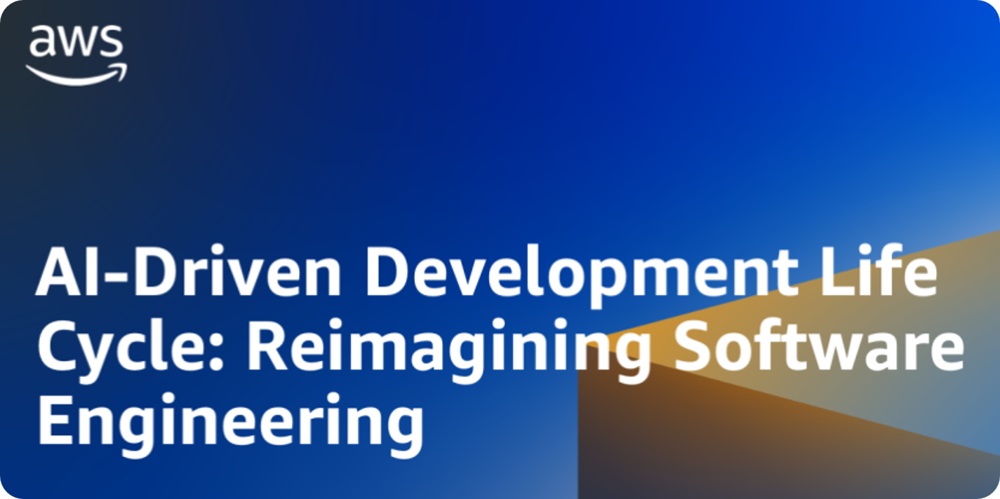

# AI-DLC (AI-Driven Development Life Cycle)

AI-DLC is a structured, adaptive software development workflow that runs inside your AI coding agent. It acts as an experienced software architect — guiding the agent from your raw idea to working, documented, tested code with a full audit trail.

This repo contains the **rule files** that power AI-DLC. When you open this workspace in a compatible AI IDE (Kiro, Cursor, Cline, Claude Code, GitHub Copilot, Amazon Q Developer), the agent automatically loads these rules and follows the workflow described here.

---

## Table of Contents

1. [What is AI-DLC?](#what-is-ai-dlc)
2. [How It Works — Step by Step](#how-it-works--step-by-step)
3. [The Three Phases](#the-three-phases)
   - [Inception Phase](#-inception-phase)
   - [Construction Phase](#-construction-phase)
   - [Operations Phase](#-operations-phase)
4. [Stage Reference](#stage-reference)
5. [Extensions](#extensions)
   - [Security Baseline](#security-baseline-extension)
   - [Property-Based Testing](#property-based-testing-extension)
6. [Directory Structure](#directory-structure)
7. [Output Directory Structure](#output-directory-structure)
8. [Key Concepts](#key-concepts)
9. [Compatibility](#compatibility)

---

## What is AI-DLC?

Most AI coding agents generate code immediately when you describe a feature. AI-DLC changes that by inserting a structured lifecycle before, during, and after code generation:

- **Before code**: The agent analyzes your workspace, gathers requirements, asks clarifying questions, designs components, and creates an explicit execution plan — all with your approval at each step.
- **During code**: The agent generates code according to the approved plan, unit by unit, with checkboxes to track progress.
- **After code**: The agent produces build, test, and verification instructions.

The result is traceable, documented, approved software instead of a pile of generated code you have to reverse-engineer.

### The Core Principle

**The workflow adapts to the work, not the other way around.**

Simple changes skip unnecessary steps. Complex, high-risk changes get the full treatment. Every stage is independently evaluated before it runs.

---

## How It Works — Step by Step

When you describe a software development task to your AI agent in a workspace that has AI-DLC installed:

1. The agent displays a welcome message and begins **Workspace Detection** — checking whether you have existing code (brownfield) or are starting fresh (greenfield).
2. For brownfield projects, the agent runs **Reverse Engineering** to analyze existing code and generate architecture documentation.
3. The agent runs **Requirements Analysis** — asking you clarifying questions in a structured file you fill in with letter-choice answers (A, B, C…).
4. The agent optionally runs **User Stories** for user-facing features.
5. The agent runs **Workflow Planning** — showing you exactly which stages it recommends running and why. You approve or modify the plan.
6. For each unit of work, the agent runs design stages (Functional Design, NFR Requirements, NFR Design, Infrastructure Design) as needed, then generates code.
7. The agent produces build and test instructions.
8. At every major stage, the agent waits for your explicit approval before proceeding.

Everything is logged to `aidlc-docs/audit.md` with ISO 8601 timestamps and your exact raw responses.

---

## The Three Phases

```
                         Your Request
                              |
                              v
        +---------------------------------------+
        |     INCEPTION PHASE                   |
        |     Planning & Application Design     |
        +---------------------------------------+
        | * Workspace Detection (ALWAYS)        |
        | * Reverse Engineering (COND)          |
        | * Requirements Analysis (ALWAYS)      |
        | * User Stories (COND)                 |
        | * Workflow Planning (ALWAYS)          |
        | * Application Design (COND)           |
        | * Units Generation (COND)             |
        +---------------------------------------+
                              |
                              v
        +---------------------------------------+
        |     CONSTRUCTION PHASE                |
        |     Design, Implementation & Test     |
        +---------------------------------------+
        | * Per-Unit Loop (for each unit):      |
        |   - Functional Design (COND)          |
        |   - NFR Requirements (COND)           |
        |   - NFR Design (COND)                 |
        |   - Infrastructure Design (COND)      |
        |   - Code Generation (ALWAYS)          |
        | * Build and Test (ALWAYS)             |
        +---------------------------------------+
                              |
                              v
        +---------------------------------------+
        |     OPERATIONS PHASE                  |
        |     Placeholder for Future            |
        +---------------------------------------+
        | * Operations (PLACEHOLDER)            |
        +---------------------------------------+
```

---

### 🔵 Inception Phase

**Purpose**: Determine WHAT to build and WHY.

| Stage | When | What Happens |
|---|---|---|
| **Workspace Detection** | Always | Detects greenfield vs brownfield. Resumes from prior state if `aidlc-state.md` exists. Creates initial state file. |
| **Reverse Engineering** | Brownfield only | Analyzes all packages and files. Generates: business overview, architecture diagram, code structure, API docs, component inventory, technology stack, dependencies, code quality assessment. Waits for approval. |
| **Requirements Analysis** | Always (adaptive depth) | Loads any reverse engineering artifacts. Analyzes your request for clarity, type, and scope. Creates a clarifying questions file for you to fill in. Generates `requirements.md`. Includes extension opt-in prompts. Waits for approval. |
| **User Stories** | Conditional | For user-facing features with multiple personas or complex acceptance criteria. Two parts: Planning (questions + plan approval) and Generation (stories.md + personas.md). |
| **Workflow Planning** | Always | Loads all prior context. Analyzes change impact across user-facing, structural, data model, API, and NFR dimensions. Determines which stages to execute or skip with rationale. Generates a Mermaid workflow visualization. Creates `execution-plan.md`. Waits for approval — **you can override any recommendation**. |
| **Application Design** | Conditional | When new components or service layers are needed. Creates: components.md, component-methods.md, services.md, component-dependency.md. Questions → answers → ambiguity resolution → generation. Waits for approval. |
| **Units Generation** | Conditional | Decomposes the system into units of work. Two parts: Planning (questions + plan approval) and Generation (unit-of-work.md, unit-of-work-dependency.md, unit-of-work-story-map.md). |

---

### 🟢 Construction Phase

**Purpose**: Determine HOW to build it. Executes per unit of work.

| Stage | When | What Happens |
|---|---|---|
| **Functional Design** | Conditional per unit | Technology-agnostic business logic design. Questions about business rules, domain models, data flow, error handling. Creates: business-logic-model.md, business-rules.md, domain-entities.md, and optionally frontend-components.md. Waits for approval. |
| **NFR Requirements** | Conditional per unit | Determines non-functional requirements and tech stack. Questions about scalability, performance, availability, security. Creates: nfr-requirements.md, tech-stack-decisions.md. Waits for approval. |
| **NFR Design** | Conditional per unit | Incorporates NFR patterns into design. Questions about resilience, scalability, performance, security, and logical infrastructure components. Creates: nfr-design-patterns.md, logical-components.md. Waits for approval. |
| **Infrastructure Design** | Conditional per unit | Maps logical components to actual cloud/infrastructure services. Questions about deployment environment, compute, storage, messaging, networking, monitoring. Creates: infrastructure-design.md, deployment-architecture.md. Waits for approval. |
| **Code Generation** | Always per unit | **Part 1 — Planning**: Creates a numbered, checkbox-tracked code generation plan and waits for your approval. **Part 2 — Generation**: Executes the plan step by step, marking each checkbox immediately after completion. Handles both new files (greenfield) and in-place modification of existing files (brownfield). Waits for approval. |
| **Build and Test** | Always (after all units) | Generates: build-instructions.md, unit-test-instructions.md, integration-test-instructions.md, performance-test-instructions.md (if applicable), and build-and-test-summary.md. Waits for approval. |

---

### 🟡 Operations Phase

**Status**: Placeholder for future expansion. The Operations phase will eventually include deployment planning, monitoring and observability setup, incident response procedures, and production readiness checklists.

All build and test activities currently live in the Construction phase.

---

## Stage Reference

### Question Format

All clarifying questions follow a consistent format in dedicated `.md` files (never in chat):

```markdown
## Question 1
What is the deployment target?

A) Cloud (AWS, Azure, GCP)

B) On-premises servers

C) Hybrid

X) Other (please describe after [Answer]: tag below)

[Answer]: 
```

You fill in the letter after `[Answer]:`. If no option fits, pick `X) Other` and describe your preference. The agent reads your answers, checks for contradictions and ambiguities, and asks follow-up questions if needed before proceeding.

### Depth Levels

AI-DLC adapts how thorough each stage is based on complexity:

| Level | Used When | What Changes |
|---|---|---|
| **Minimal** | Simple, clear request | Concise artifacts with essential detail only |
| **Standard** | Normal complexity | Standard artifacts with moderate detail |
| **Comprehensive** | Complex or high-risk | Full artifacts with all safeguards and traceability |

All defined artifacts for a stage are always created when that stage executes — depth affects detail level within them, not which files get created.

### Session Continuity

If you return to an existing AI-DLC project, the agent reads `aidlc-state.md`, loads all prior artifacts from completed stages, and presents a resume prompt showing where you left off and what comes next.

---

## Extensions

Extensions are optional rule sets you opt into during Requirements Analysis. Each extension adds hard constraints that the agent enforces at every applicable stage.

When Requirements Analysis runs, the agent presents opt-in questions for each available extension. Opting **in** loads the full ruleset immediately and enforces it as blocking constraints throughout the workflow. Opting **out** skips the ruleset entirely — saving context.

Extension status is recorded in `aidlc-docs/aidlc-state.md` under `## Extension Configuration`.

A **blocking finding** means the agent cannot present "Continue to Next Stage" until the issue is resolved. The finding appears in the stage completion summary with a rule ID and must be logged in `audit.md`.

---

### Security Baseline Extension

**Location**: `.kiro/aws-aidlc-rule-details/extensions/security/baseline/`

Enforces 15 security rules as hard constraints across all phases. Suitable for production-grade applications.

| Rule | Enforces |
|---|---|
| SECURITY-01 | Encryption at rest (managed or CMK) and in transit (TLS 1.2+) for all data stores |
| SECURITY-02 | Access logging on all network intermediaries (load balancers, API gateways, CDNs) |
| SECURITY-03 | Structured application-level logging with centralized output; no PII/secrets in logs |
| SECURITY-04 | HTTP security headers (CSP, HSTS, X-Content-Type-Options, X-Frame-Options, Referrer-Policy) on all HTML endpoints |
| SECURITY-05 | Input validation on every API endpoint: type, length, format, sanitization, parameterized queries |
| SECURITY-06 | Least-privilege IAM policies: specific resources, specific actions, no wildcards without documented exception |
| SECURITY-07 | Deny-by-default network config: no 0.0.0.0/0 inbound except ports 80/443 on public load balancers |
| SECURITY-08 | Application-level access control: deny-by-default routes, object-level authorization, CORS restrictions, server-side token validation |
| SECURITY-09 | Security hardening: no default credentials, generic error responses, no directory listing, public storage blocked |
| SECURITY-10 | Supply chain security: pinned dependencies, lock files, vulnerability scanning, SBOM, no `latest` tags in production |
| SECURITY-11 | Secure design principles: isolated security modules, defense in depth, rate limiting on public APIs |
| SECURITY-12 | Authentication and credential management: adaptive password hashing, MFA for admin, brute-force protection, no hardcoded secrets |
| SECURITY-13 | Software and data integrity: safe deserialization, artifact checksums, CI/CD access controls, SRI for CDN scripts |
| SECURITY-14 | Security alerting and monitoring: alerts on auth failures and privilege escalation, append-only logs, 90-day minimum retention |
| SECURITY-15 | Safe exception handling: explicit error handling on all external calls, fail-closed behavior, global error handler, no internal detail in user-facing errors |

---

### Property-Based Testing Extension

**Location**: `.kiro/aws-aidlc-rule-details/extensions/testing/property-based/`

Enforces property-based testing (PBT) rules for code with identifiable testable properties. Suitable for projects with business logic, data transformations, serialization, or stateful components.

**Three opt-in levels**:
- **Full** — all 10 rules enforced
- **Partial** — only PBT-02, 03, 07, 08, 09 enforced (pure functions and serialization)
- **None** — suitable for simple CRUD or UI-only projects

| Rule | Enforces |
|---|---|
| PBT-01 | Property identification during Functional Design — every unit analyzed for round-trip, invariant, idempotence, commutativity, oracle, induction, and easy-verification properties |
| PBT-02 | Round-trip tests for all serialize/deserialize, encode/decode, parse/format pairs |
| PBT-03 | Invariant tests for size preservation, element preservation, ordering, range constraints, and business rule invariants |
| PBT-04 | Idempotency tests (`f(f(x)) = f(x)`) for PUT/DELETE endpoints, normalization functions, and deduplication logic |
| PBT-05 | Oracle/model-based tests when a reference implementation exists (optimized vs brute-force, refactored vs legacy) |
| PBT-06 | Stateful PBT for components with mutable state (caches, state machines, queues, shopping carts) using command sequences against a simplified model |
| PBT-07 | Domain-specific generators with business constraints — no raw primitives for domain-typed parameters; centralized, reusable generator definitions |
| PBT-08 | Shrinking enabled, seed-based reproducibility, seed logged on failure, PBT in CI |
| PBT-09 | Framework selection documented in tech stack decisions (Hypothesis for Python, fast-check for JS/TS, jqwik for Java, etc.) |
| PBT-10 | PBT complements example-based tests — critical paths have both; failures become permanent regression examples |

---

## Directory Structure

### This Repo (Rule Files)

```
.kiro/
├── aws-aidlc-rule-details/         # Rule detail files loaded by the agent
│   ├── common/                     # Shared rules used across all stages
│   │   ├── ascii-diagram-standards.md
│   │   ├── content-validation.md   # Diagram and content validation rules
│   │   ├── depth-levels.md         # How adaptive depth works
│   │   ├── error-handling.md       # Error recovery procedures
│   │   ├── overconfidence-prevention.md
│   │   ├── process-overview.md     # Technical workflow overview with Mermaid diagram
│   │   ├── question-format-guide.md # Question file format and validation rules
│   │   ├── session-continuity.md   # Resume workflow templates
│   │   ├── terminology.md          # Glossary of all AI-DLC terms
│   │   ├── welcome-message.md      # Welcome message shown at workflow start
│   │   └── workflow-changes.md
│   ├── inception/                  # Inception phase stage rules
│   │   ├── workspace-detection.md
│   │   ├── reverse-engineering.md
│   │   ├── requirements-analysis.md
│   │   ├── user-stories.md
│   │   ├── workflow-planning.md
│   │   ├── application-design.md
│   │   └── units-generation.md
│   ├── construction/               # Construction phase stage rules
│   │   ├── functional-design.md
│   │   ├── nfr-requirements.md
│   │   ├── nfr-design.md
│   │   ├── infrastructure-design.md
│   │   ├── code-generation.md
│   │   └── build-and-test.md
│   ├── extensions/                 # Optional extension rule sets
│   │   ├── security/baseline/
│   │   │   ├── security-baseline.opt-in.md   # Opt-in prompt shown during Requirements Analysis
│   │   │   └── security-baseline.md          # Full 15-rule security ruleset
│   │   └── testing/property-based/
│   │       ├── property-based-testing.opt-in.md
│   │       └── property-based-testing.md     # Full 10-rule PBT ruleset
│   └── operations/
│       └── operations.md           # Placeholder for future operations phase
└── steering/
    └── aws-aidlc-rules/
        └── core-workflow.md        # Master workflow orchestration rules (loaded automatically by Kiro)
```

### Output Directory (Generated by the Agent in Your Project)

When AI-DLC runs against your project, it creates this documentation tree alongside your application code:

```
your-project/
├── [your application code]         # All source code at workspace root (NEVER in aidlc-docs/)
└── aidlc-docs/
    ├── inception/
    │   ├── plans/
    │   │   ├── user-stories-assessment.md
    │   │   ├── story-generation-plan.md
    │   │   ├── application-design-plan.md
    │   │   ├── unit-of-work-plan.md
    │   │   └── execution-plan.md
    │   ├── reverse-engineering/    # Brownfield only
    │   │   ├── business-overview.md
    │   │   ├── architecture.md
    │   │   ├── code-structure.md
    │   │   ├── api-documentation.md
    │   │   ├── component-inventory.md
    │   │   ├── technology-stack.md
    │   │   ├── dependencies.md
    │   │   ├── code-quality-assessment.md
    │   │   └── reverse-engineering-timestamp.md
    │   ├── requirements/
    │   │   ├── requirement-verification-questions.md
    │   │   └── requirements.md
    │   ├── user-stories/
    │   │   ├── stories.md
    │   │   └── personas.md
    │   └── application-design/
    │       ├── components.md
    │       ├── component-methods.md
    │       ├── services.md
    │       ├── component-dependency.md
    │       ├── application-design.md
    │       ├── unit-of-work.md
    │       ├── unit-of-work-dependency.md
    │       └── unit-of-work-story-map.md
    ├── construction/
    │   ├── plans/
    │   │   ├── {unit-name}-functional-design-plan.md
    │   │   ├── {unit-name}-nfr-requirements-plan.md
    │   │   ├── {unit-name}-nfr-design-plan.md
    │   │   ├── {unit-name}-infrastructure-design-plan.md
    │   │   └── {unit-name}-code-generation-plan.md
    │   ├── {unit-name}/
    │   │   ├── functional-design/
    │   │   │   ├── business-logic-model.md
    │   │   │   ├── business-rules.md
    │   │   │   ├── domain-entities.md
    │   │   │   └── frontend-components.md  # If unit has UI
    │   │   ├── nfr-requirements/
    │   │   │   ├── nfr-requirements.md
    │   │   │   └── tech-stack-decisions.md
    │   │   ├── nfr-design/
    │   │   │   ├── nfr-design-patterns.md
    │   │   │   └── logical-components.md
    │   │   ├── infrastructure-design/
    │   │   │   ├── infrastructure-design.md
    │   │   │   └── deployment-architecture.md
    │   │   └── code/                       # Markdown summaries only
    │   └── build-and-test/
    │       ├── build-instructions.md
    │       ├── unit-test-instructions.md
    │       ├── integration-test-instructions.md
    │       ├── performance-test-instructions.md
    │       ├── contract-test-instructions.md   # Microservices only
    │       ├── security-test-instructions.md   # If security extension enabled
    │       ├── e2e-test-instructions.md        # If applicable
    │       └── build-and-test-summary.md
    ├── operations/                 # Placeholder
    ├── aidlc-state.md              # Current workflow state and stage progress
    └── audit.md                    # Complete log of all interactions with timestamps
```

---

## Key Concepts

### Greenfield vs Brownfield

- **Greenfield**: New project with no existing code. Skips Reverse Engineering. Code is placed at `src/`, or `{unit-name}/src/` for microservices.
- **Brownfield**: Existing codebase. Runs Reverse Engineering first. Code is modified in-place — never creates copies like `ClassName_modified.java`.

### Units of Work

A unit of work is a logical grouping of user stories for development purposes. For microservices, each unit becomes an independently deployable service. For monoliths, it may be a logical module within a single application. Units are defined during the Units Generation stage and each unit proceeds through the Construction phase independently.

### Two-Part Stages

Several stages have two internal parts:
- **Planning**: Generates a plan with numbered, checkbox-tracked steps. Asks questions. Waits for your approval.
- **Generation**: Executes the approved plan, marking `[x]` on each checkbox immediately after that step completes.

This applies to: User Stories, Units Generation, and Code Generation.

### Audit Trail

Every user input, AI response, approval prompt, and approval decision is logged in `aidlc-docs/audit.md` with ISO 8601 timestamps. The exact raw text of your responses is captured — never summarized.

### Checkbox Tracking

Two-level tracking:
- **Plan-level**: Checkboxes inside each stage plan file (`[ ]` → `[x]`)
- **Stage-level**: Overall workflow progress in `aidlc-state.md`

Both update in the same interaction where work is completed.

### Automation-Friendly Code

When generating UI code (web, mobile, desktop), the agent adds `data-testid` attributes to all interactive elements using the naming pattern `{component}-{element-role}` (e.g., `login-form-submit-button`). Values are stable and only change when the element's purpose changes.

---

## Compatibility

AI-DLC rule files are resolved from the first matching path in your project:

| Path | IDE / Setup |
|---|---|
| `.aidlc/aidlc-rules/aws-aidlc-rule-details/` | AI-assisted setup |
| `.aidlc-rule-details/` | Cursor, Cline, Claude Code, GitHub Copilot, OpenAI Codex |
| `.kiro/aws-aidlc-rule-details/` | **Kiro IDE** (this repo uses this path) |
| `.amazonq/aws-aidlc-rule-details/` | Amazon Q Developer |

The master orchestration rules file that loads the workflow is at `.kiro/steering/aws-aidlc-rules/core-workflow.md`. In Kiro IDE, steering files are automatically loaded into context for every interaction.
